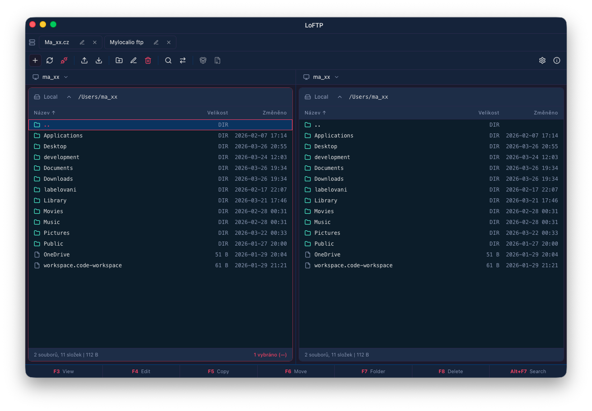
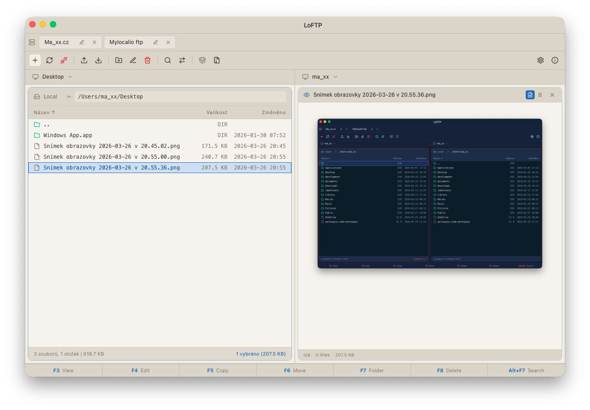

# LoFTP

## Why LoFTP Exists

LoFTP started from a simple need: on macOS, I was missing the speed and workflow of Total Commander, and none of the available alternatives felt right for the way I work. So I started building my own file manager, focused on practical day-to-day use instead of feature lists for their own sake.

LoFTP brings a fast dual-pane workflow to macOS and combines local file management with direct access to remote servers in a way that stays efficient, familiar, and immediate.

## What It Does

LoFTP is a dual-pane file manager for macOS built for working with both local and remote files. The application currently includes:

- FTP, FTPS, and SFTP connections
- Unlimited saved server profiles with one-click access
- Upload and download of files and directories
- Transfer queue with progress, speed, ETA, and cancellation
- Directory comparison between local and remote locations
- Search by file name and file content
- Archive browsing, extraction, and archive creation
- Quick preview for text files, PDF documents, images, and binary files
- Built-in text editor for fast file changes
- Quick access to disks, cloud storage locations, and common local paths
- Light and dark themes, in-app updates, and localization in English, Czech, German, Slovak, Polish, and Spanish

## Main Advantage

The main advantage of LoFTP is straightforward: it does not limit how many FTP or SFTP connections you can save, and those connections are available in a single click. The goal is to remove friction from switching between projects, servers, and environments.

Connection credentials are stored using the system keychain, so saved access remains convenient without giving up basic security.

## Licensing And Project Support

The home page of the project is [www.loftp.space](https://www.loftp.space), where you can purchase a license or, more accurately, support further development of the project.

The application itself works without any functional limitations. Buying a license is primarily a way to support continued development, future improvements, and long-term maintenance.

## Feedback And Contributions

If you have an idea for an improvement, want to contribute, or would like to help shape the next version, feel free to get in touch.

If you send a useful improvement or code contribution, I will be happy to include it in a future release of LoFTP.

## Contact

info@mylocalio.com

Bradacz
